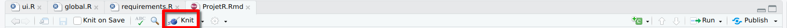
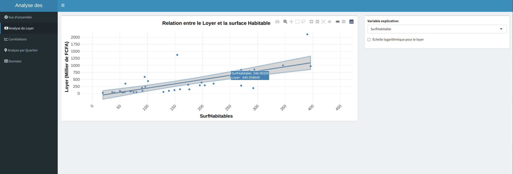

# Dakar Immobilier App

This repository contains an R Shiny application for analyzing Dakar data.

## Prerequisites

Before running the application, make sure you have the following installed:

- [R](https://www.r-project.org/) (version 4.0.0 or higher recommended)
- [RStudio](https://www.rstudio.com/products/rstudio/download/)

## Installation

1. Clone this repository or download the source code.
2. Open RStudio.
3. Open the project by navigating to the project directory.

## Installing Required Packages

The application requires several R packages. You can install them by running the `requirements.R` script:

1. Open the `requirements.R` file in RStudio.
2. Click on "Source" button in the top-right corner of the editor or press Ctrl+Shift+S (Cmd+Shift+S on Mac).

Alternatively, you can run the following command in the R console:

```r
source("requirements.R")
```

## Running the Application

There are several ways to run the Shiny app:

### Method 1: Using RStudio's "Run App" Button

1. Open any of the app files (`ui.R`, `server.R`, or `global.R`) in RStudio.
2. Click on the "Run App" button that appears in the top-right corner of the editor.


### Method 2: Using the R Console

Run the following command in the R console:

```r
shiny::runApp()
```

### Method 3: Running from a Script

Create a new R script with the following content and run it:

```r
setwd("/path/to/dakar_app")  # Replace with the actual path to the app directory
shiny::runApp()
```

## Application Structure

- `ui.R`: Contains the user interface code
- `server.R`: Contains the server logic
- `global.R`: Contains global variables and functions used by both UI and server
- `requirements.R`: Script to install required packages
- `dakar.csv`: Dataset containing Dakar Rally data
- `ProjetR.Rmd`: R Markdown document with analysis and documentation

## Running the R Markdown Document

The project includes an R Markdown file (`ProjetR.Rmd`) that contains additional analysis and documentation. To run this file:

1. Open `ProjetR.Rmd` in RStudio.
2. Click on the "Knit" button in the top editor toolbar.



3. Select your preferred output format (HTML, PDF, or Word).
4. The document will be rendered and a new window will open with the results.

Alternatively, you can use keyboard shortcuts:
- Knit to HTML: Ctrl+Shift+K (Cmd+Shift+K on Mac)
- Knit to PDF: Ctrl+Shift+P (Cmd+Shift+P on Mac)
- Knit to Word: Ctrl+Shift+W (Cmd+Shift+W on Mac)

## Screenshots




